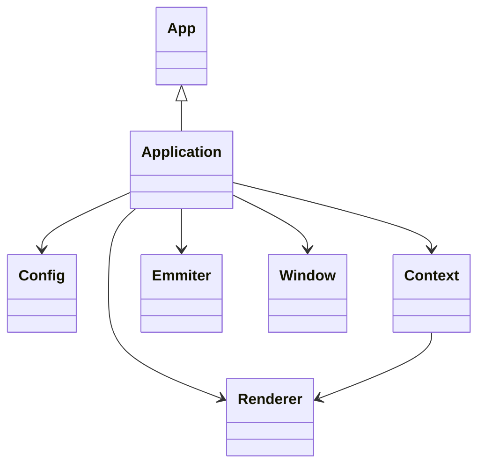

# Concept
This is the main concept of the project, which delivers a good overview about the inner workings.

### Architecture


### Dependency Diagram


### Structure
```md
3rd-Party/
├─ EnTT/
└─ ...

Vite/ [Library]
├─ Base/
|  ├─ Algorithms/
│  │  └─ Algorithms
│  ├─ Bridges/
│  │  ├─ Assimp
│  │  ├─ DearImGui
│  │  ├─ EnTT
│  │  ├─ FreeType
│  │  ├─ Glad
│  │  ├─ GLM
│  │  ├─ MsdfAtlasGen
│  │  ├─ ShaderC
│  │  ├─ STB
│  │  └─ YamlCpp
│  ├─ Devices/
│  │  ├─ Input/
│  │  │  ├─ Controller
│  │  │  ├─ Input
│  │  │  ├─ Keyboard
│  │  │  ├─ Mouse
│  │  │  └─ Touch
│  │  ├─ Devices
│  │  ├─ Display
│  │  ├─ GFXContext
│  │  └─ SFXContext
│  ├─ Extensions/
│  │  └─ Extensions
│  ├─ Mathematics/
│  │  ├─ Geometry
│  │  ├─ Mathematics
│  │  ├─ Matrix
│  │  ├─ Quaternion
│  │  └─ Vector
│  ├─ Memory/
│  │  └─ Memory
│  ├─ Platform/
│  │  ├─ Detection
│  │  └─ Support
│  ├─ Runtime/
│  │  ├─ Reflection
│  │  └─ Runtime
│  ├─ System/
│  │  ├─ Cli
│  │  ├─ Dialog
│  │  ├─ FileSystem
│  │  ├─ Module
│  │  ├─ System
│  │  └─ Window
│  ├─ Types/
│  │  ├─ Component
│  │  ├─ Concepts
│  │  ├─ Delegate
│  │  ├─ Entity
│  │  ├─ Literals
│  │  ├─ Object
│  │  ├─ Property
│  │  ├─ SmartPointer
│  │  ├─ Standard
│  │  ├─ SourceLocation
│  │  ├─ System
│  │  ├─ Timestamp
│  │  ├─ Types
│  │  └─ UUID
│  ├─ Wrappers/
│  │  └─ 3rd-Party
│  └─ Base
├─ Core/
│  ├─ App/
│  │  ├─ App
│  │  ├─ Arguments
│  │  ├─ Layers (or Composition?)
│  │  ├─ Settings
│  │  ├─ States
│  │  └─ Statistics
│  ├─ Config/
│  │  └─ Config
│  ├─ Debug/
│  │  ├─ Debug
│  │  ├─ Memory
│  │  └─ Profiler
│  ├─ Events/
│  │  ├─ Dispatcher
│  │  ├─ Emitter
│  │  ├─ Events
│  │  └─ Signal
│  ├─ Logger/
│  │  ├─ Logger
│  │  ├─ LogLevel
│  │  ├─ LogRecord
│  │  └─ LogSink
│  ├─ Network/
│  │  └─ Network
│  ├─ Serializer/
│  │  └─ Serializer
│  ├─ Utils/
│  │  ├─ Chrono
│  │  ├─ Random
│  │  ├─ String
│  │  ├─ ThreadPool
│  │  ├─ Timer
│  │  └─ Util
│  └─ Core
├─ Engine/
│  ├─ Animation/
│  │  └─ Animation
│  ├─ Asset/
│  │  ├─ AssetManager
│  │  ├─ Assets
│  │  ├─ Font
│  │  ├─ Material
│  │  ├─ Mesh
│  │  └─ Sprite
│  ├─ Effects/
│  │  ├─ Particles/
│  │  │  └─ Particles
│  │  ├─ PostProcessing/
│  │  │  └─ PostProcessing
│  │  └─ Effects
│  ├─ Media/
│  │  ├─ Audio/
│  │  │  └─ Audio
│  │  ├─ Video/
│  │  │  └─ Video
│  │  └─ Media
│  ├─ Networking/
│  │  └─ Networking
│  ├─ Physics/
│  │  └─ Physics
│  ├─ Renderer/
│  │  ├─ Camera/
│  │  │  ├─ Camera
│  │  │  └─ DesignerCamera
│  │  ├─ Specialized/
│  │  │  ├─ FontRenderer
│  │  │  ├─ MeshRenderer
│  │  │  ├─ SceneRenderer
│  │  │  ├─ SpriteRenderer
│  │  │  └─ UIRenderer
│  │  ├─ Buffer
│  │  ├─ CommandBuffer
│  │  ├─ FrameBuffer
│  │  ├─ PipelineState
│  │  ├─ RenderDevice
│  │  ├─ Renderer
│  │  ├─ Shader
│  │  ├─ ShaderCompiler
│  │  ├─ SwapChain
│  │  ├─ Texture
│  │  └─ Viewport
│  ├─ Scene/
│  │  ├─ Components
│  │  ├─ Scene
│  │  └─ SceneCamera
│  ├─ Scripting/
│  │  ├─ CameraController
│  │  └─ Scripting
│  ├─ UI/
|  │  ├─ Aurora/
│  │  │  ├─ Aurora
│  │  │  ├─ Components
│  │  │  ├─ Containers
│  │  │  └─ Controls
|  │  ├─ DearImGui/
|  │  │  ├─ Styles/
│  │  │  │  ├─ MaterialDesign
│  │  │  │  └─ Styles
│  │  │  ├─ GuiBuilder
│  │  │  └─ GuiLayer
│  │  └─ UI
│  └─ Engine
├─ Platform/
│  ├─ DirectX/
│  │  ├─ DXContext
│  │  ├─ DXRenderer
│  │  ├─ ...
│  │  └─ DirectX
│  ├─ OpenGL/
│  │  ├─ GLContext
│  │  ├─ GLRenderer
│  │  ├─ ...
│  │  └─ OpenGL
│  ├─ Vulkan/
│  │  ├─ VKContext
│  │  ├─ VKRenderer
│  │  ├─ ...
│  │  └─ Vulkan
│  └─ WinAPI/
│     ├─ WinDialog
│     ├─ WinDisplay
│     ├─ WinEvents
│     ├─ WinInput
│     └─ WinWindow
├─ Tools/
│  ├─ Build/
│  │  └─ Build
│  └─ Tools
├─ EntryPoint
└─ Vite

Vivid/ [Editor]
├─ Components/
├─ Panels/
└─ Views/
```
