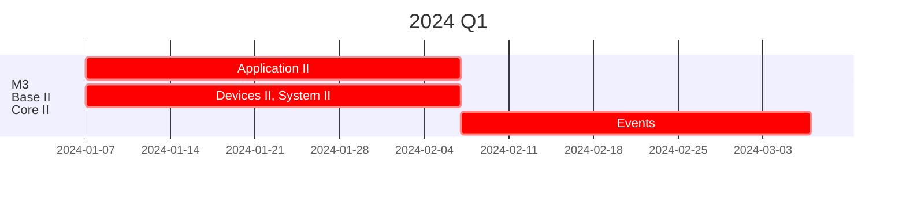
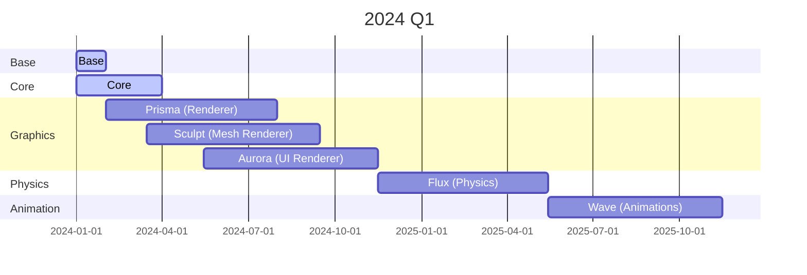
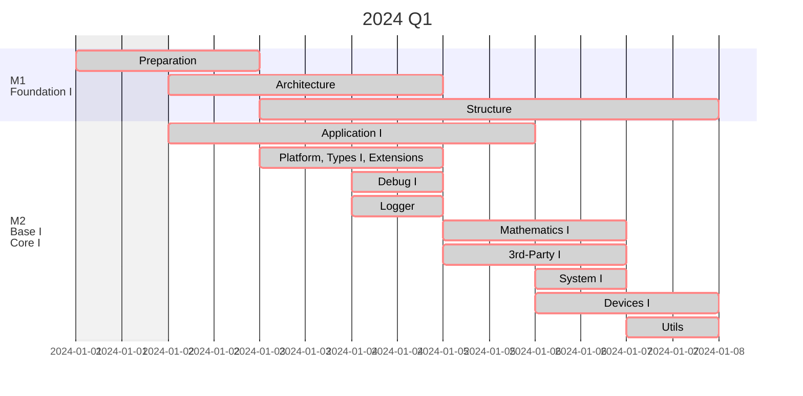

# Roadmap
The following roadmap is conceptional and consoider it now like a draft, this project is in an early stage and under heavy development, so the milestones will shift quite often.

## Active
I will try to keep this roadmap up to date, but it is not a promise.
### 2024 Q1

## Overview
This is my wish, what I want to achieve with this project. It is a long way to go, but I am confident that I can make it.

## History
#### 2024

