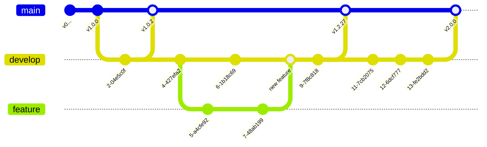

# Worflow Strategy
During heavy development, we push everything directly to the main branch. Until we reach the first public release v1.0.0, we will start using a develop branch. The main branch will then be reserved only for stable releases, which will also be tagged.

Later, we will also need feature branches for larger features. These will split from the develop branch and be merged back once they are feature complete.

> As everyone nowadays should, we are using semantic versioning rules for our projects.
